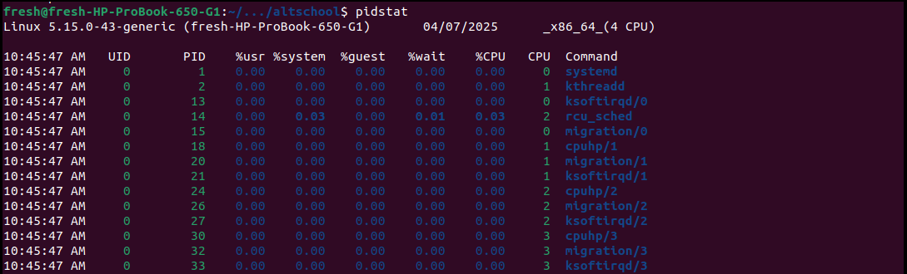
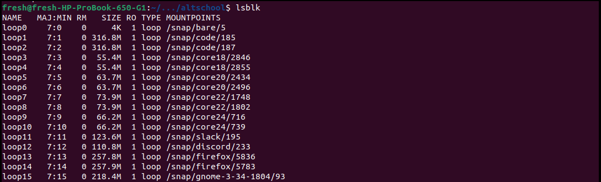

# Linux Commands

## 1. pidstat
	- Displays statistics for Linux tasks — like CPU, memory, and I/O usage per PID

## 2. lsblk
	- Lists all block devices in a tree-like format. Used for identifying attached drives or partitions.

## 3. stat
	- Displays detailed info about a file 

## 4. ss
	- Show socket statisics

## 5. tcpdump
	- Captures network traffic for inspection

## 6. watch
	- Re-runs a command at intervals for monitoring in real-time

## 7. timeout
	- Runs a command with a time limit 

## 8. basename
	- Extracts the filename from a full path

## 9. dirname
	- Extracts the directory path

## 10. seq
	- Generate sequence of numbers

