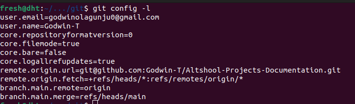
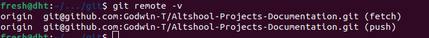
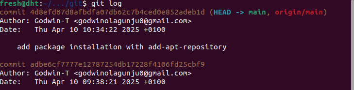

# Git Commands Reference

This README provides a brief explanation of common Git commands for repository inspection.

## Git Configuration

### `git config -l`

The `git config -l` (or `git config --list`) command displays all configured Git settings for the current repository and user.

```bash
git config -l
```


This command is useful for:
- Verifying your user identity settings
- Checking repository-specific configurations
- Troubleshooting Git issues related to configuration

## Remote Repository Information

### `git remote -v`

The `git remote -v` command lists all remote repositories connected to your local repository, along with their URLs.

```bash
git remote -v
```


This command is useful for:
- Verifying remote repository connections
- Checking push and fetch URLs
- Confirming multiple remote connections (like origin and upstream)

## Commit History

### `git log`

The `git log` command displays the commit history of your repository.

```bash
git log
```


**Useful variations:**

1. Single-line format:
   ```bash
   git log --oneline
   ```

2. Graphical representation (for visualizing branches):
   ```bash
   git log --graph --oneline --decorate
   ```

3. Limit number of commits shown:
   ```bash
   git log -n 5  # Shows only the last 5 commits
   ```

4. Search by author:
   ```bash
   git log --author="Jane Doe"
   ```

5. Show changes for each commit:
   ```bash
   git log -p
   ```

The `git log` command is essential for:
- Reviewing project history
- Finding specific changes
- Understanding who made what changes and when
- Navigating between different versions of the code
