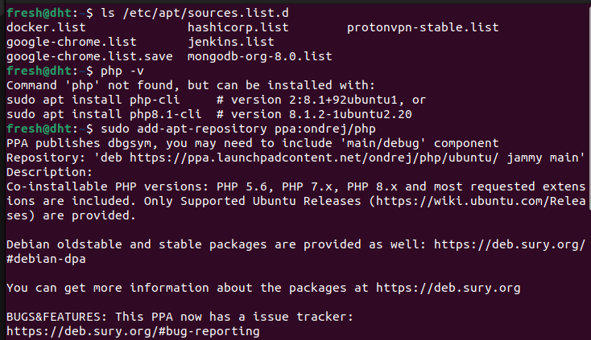
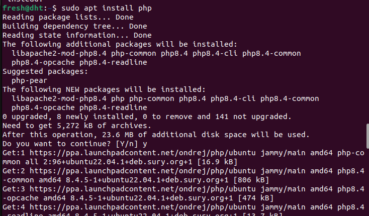
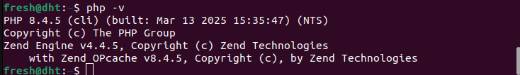

# Installing PHP Using Ondrej's PPA

## Overview

The Personal Package Archive (PPA) maintained by Ondrej Surý is the recommended source for installing PHP on Ubuntu and Debian-based systems. This PPA provides up-to-date PHP versions that may not be available in the standard distribution repositories.

## Adding the PPA

To add Ondrej's PHP PPA to your system:

```bash
sudo add-apt-repository ppa:ondrej/php
```



This command:
- Adds the repository to your system's software sources
- Imports the repository's GPG key for package verification
- Updates the package list automatically

## Why Use This PPA?

- Access to multiple PHP versions
- Regular updates with security fixes
- Ability to install and run multiple PHP versions simultaneously
- PHP extensions and modules are also available

## Installing PHP

After adding the PPA, you can install PHP:

```bash
# Install PHP 
sudo apt update
sudo apt install php
```


## Verifying Installation

Check your PHP version:

```bash
php -v
```


## Removing the PPA

If you need to remove the PPA:

```bash
sudo add-apt-repository --remove ppa:ondrej/php
```

