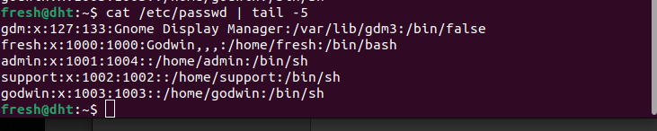
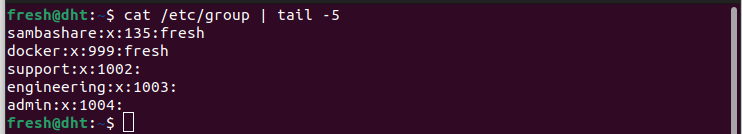
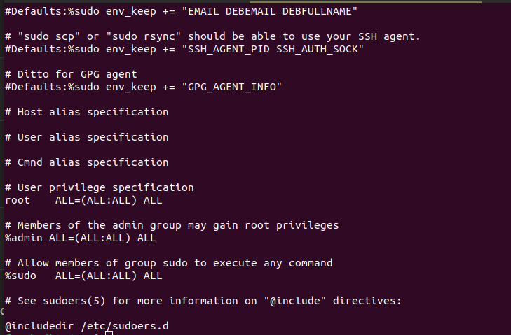

# Linux Users and Groups

This repository provides documentation and examples for managing users and groups in Linux systems, demonstrating common commands and configuration files used in system administration.

## Introduction

Understanding users and groups is fundamental to Linux security and access control. This repository covers the basics of user and group management, demonstrating practical examples of common administrative tasks.

## Commands Covered

### User Management

#### Creating Users
```bash
sudo useradd [options] username
```

The `useradd` command creates new users on the system with various configuration options:
- `-m`: Create a home directory
- `-s /path/to/shell`: Specify the user's login shell
- `-G groupname`: Add the user to supplementary groups
- `-c "Comment"`: Add a comment/description for the user

#### Viewing User Information
```bash
cat /etc/passwd
```


The `/etc/passwd` file contains essential user information including:
- Username
- User ID (UID)
- Group ID (GID)
- Home directory
- Default shell

### Group Management

#### Creating Groups
```bash
sudo groupadd groupname
```
The `groupadd` command creates a new group on the system.

#### Viewing Group Information
```bash
cat /etc/group
```


The `/etc/group` file contains all group information including:
- Group name
- Group ID (GID)
- List of users who are members of the group

### Managing Sudo Access

#### Editing Sudoers File
```bash
sudo visudo
```

The `visudo` command safely edits the `/etc/sudoers` file, which controls sudo privileges. It performs syntax checking to prevent configuration errors that could lock you out of administrative access.



## Common Use Cases

- Creating users for different organizational roles
- Setting up groups to manage shared resource access
- Configuring sudo access for system administrators
- Managing file permissions based on user and group ownership

## Important Files

- `/etc/passwd`: User account information
- `/etc/group`: Group definitions
- `/etc/sudoers`: Sudo access configuration

## Security Best Practices

- Use strong passwords for all accounts, especially root and sudo users
- Grant minimum necessary privileges to users
- Use groups effectively to manage access to resources
- Regularly audit user accounts and group memberships
- Always use `visudo` to edit the sudoers file
